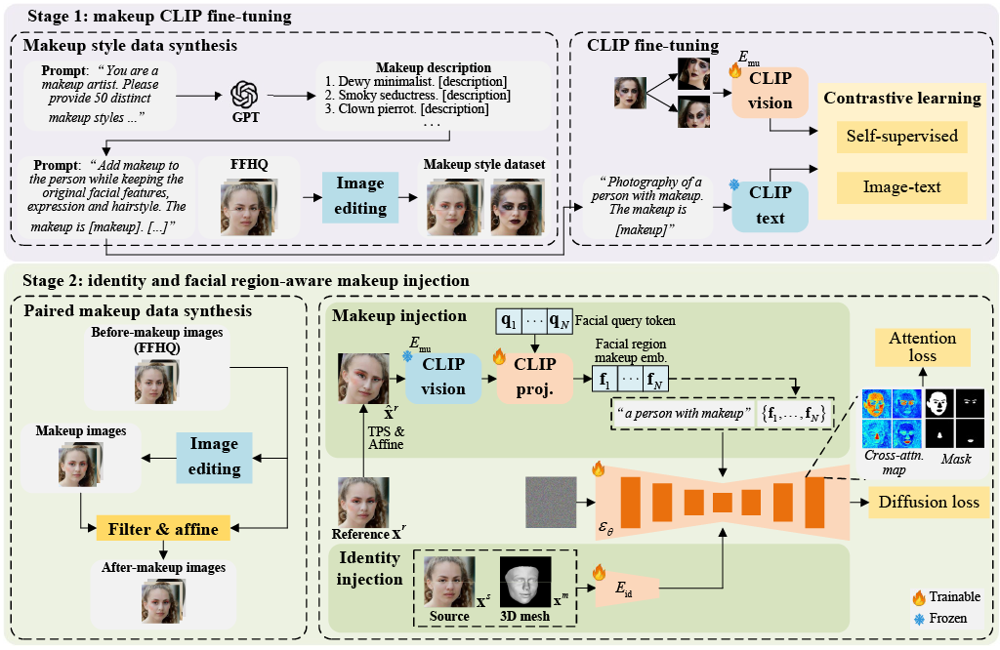

<div align="center">

# Facial Region-Aware Makeup Transfer
## Diffusion-Based Makeup Transfer with Facial Region-Aware Makeup Features
### CVPR'26

<a href="https://zaczgao.github.io" target="_blank">Zheng Gao*</a><sup>1</sup>,
<a href="https://scholar.google.com/citations?user=8Wc3A1IAAAAJ&hl=en" target="_blank">Debin Meng</a><sup>1</sup>, 
<a href="https://yoqim.github.io" target="_blank">Yunqi Miao</a><sup>2</sup>, 
<a href="https://zhangzhensong.github.io" target="_blank">Zhensong Zhang</a><sup>2</sup>,
<a href="" target="_blank">Songcen Xu</a><sup>2</sup>,
<a href="https://sites.google.com/view/ioannispatras/home" target="_blank">Ioannis Patras</a><sup>1</sup>,
<a href="https://scholar.google.com/citations?user=9a1PjCIAAAAJ&hl=en" target="_blank">Jifei Song</a><sup>2</sup>

<sup>1</sup>Queen Mary University of London, <sup>2</sup>Huawei London Research Center

<sup>*</sup>Tech Lead & Corresponding Author

[](https://arxiv.org/abs/2603.20012)

</div>

---


## Introduction

**FRAM** [CVPR'26] is a diffusion-based facial makeup transfer model with regional controllability. It can perform global makeup transfer and region-specific makeup transfer.

1. A data synthesis pipeline with better face region alignment.

2. **Learn a makeup CLIP encoder** by fine-tuning CLIP on synthesized annotated makeup style data.

3. **Make a first attempt** to enable diffusion-based region-specific makeup transfer via learnable queries and attention loss.


> **Abstract**: Current diffusion-based makeup transfer methods commonly use the makeup information encoded by off-the-shelf foundation models (e.g., CLIP) as condition to preserve the makeup style of reference image in the generation. Although effective, these works mainly have two limitations: (1) foundation models pre-trained for generic tasks struggle to capture makeup styles; (2) the makeup features of reference image are injected to the diffusion denoising model as a whole for global makeup transfer, overlooking the facial region-aware makeup features (i.e., eyes, mouth, etc) and limiting the regional controllability for region-specific makeup transfer. To address these, in this work, we propose Facial Region-Aware Makeup features (FRAM), which has two stages: (1) makeup CLIP fine-tuning; (2) identity and facial region-aware makeup injection. For makeup CLIP fine-tuning, unlike prior works using off-the-shelf CLIP, we synthesize annotated makeup style data using GPT-o3 and text-driven image editing model, and then use the data to train a makeup CLIP encoder through self-supervised and image-text contrastive learning. For identity and facial region-aware makeup injection, we construct before-and-after makeup image pairs from the edited images in stage 1 and then use them to learn to inject identity of source image and makeup of reference image to the diffusion denoising model for makeup transfer. Specifically, we use learnable tokens to query the makeup CLIP encoder to extract facial region-aware makeup features for makeup injection, which is learned via an attention loss to enable regional control. As for identity injection, we use a ControlNet Union to encode source image and its 3D mesh simultaneously. The experimental results verify the superiority of our regional controllability and our makeup transfer performance.

<p align="center">
  
</p>

---


## News
- `[2026.03.20]` Code is released.

---


## Installation

```bash
conda create -n fram python=3.10
conda activate fram

# Install PyTorch with CUDA support

# basic dependencies
pip install -r requirement.txt

# dependencies for 3DDFA-v3
git clone https://github.com/NVlabs/nvdiffrast.git
cd nvdiffrast
git checkout v0.4.0
pip install --no-build-isolation .
```
---


## Inference

Download checkpoints from the [Model Zoo](#model-zoo) section.


### Global makeup transfer

```bash
DM_CKPT="stabilityai/stable-diffusion-2-1-base"
STYLE_CLIP_CKPT="./output/vit_style_clip/checkpoints/epoch_50.pt"
PLACEHOLDER="<part>"
PROMPT="a person with makeup"
CLIP_LORA=1
CLIP_HIDDEN="6,24"
NUM_PARTS=4
USE_IPA=1
USE_TEXT_INV=0
SD_LORA=1
SD_LORA_RANK=8
SD_LORA_ALPHA=16
GEO_MODE="3d"
OUT_DIR="./output/dm"

python -u ./test_dm.py \
 --pretrained_model_name_or_path=${DM_CKPT} \
 --ckpt_dir=${OUT_DIR} \
 --style_clip_ckpt=${STYLE_CLIP_CKPT} --use_clip_lora=${CLIP_LORA} --clip_hidden=${CLIP_HIDDEN} \
 --placeholder_token=${PLACEHOLDER} \
 --use_ipa=${USE_IPA} --use_text_inv=${USE_TEXT_INV} --geo_mode=${GEO_MODE} \
 --num_parts=${NUM_PARTS} --use_lora=${SD_LORA} \
 --data_id_path="/path/to/id/image" \
 --data_makeup_path="/path/to/makeup/image" \
 --validation_prompt="${PROMPT}" \
 --guidance_scale=7.5 --ipa_scale=1.0 \
 --detect_face=1 --exp_ratio=-1 --use_square=1 \
 --vis_all=1 --vis_attn=1 \
 --out_dir="./result"
```

### Region-specific makeup transfer

```bash
DM_CKPT="stabilityai/stable-diffusion-2-1-base"
STYLE_CLIP_CKPT="./output/vit_style_clip/checkpoints/epoch_50.pt"
PLACEHOLDER="<part>"
PROMPT="a person with makeup"
CLIP_LORA=1
CLIP_HIDDEN="6,24"
NUM_PARTS=4
USE_IPA=1
USE_TEXT_INV=0
SD_LORA=1
SD_LORA_RANK=8
SD_LORA_ALPHA=16
GEO_MODE="3d"
OUT_DIR="./output/dm"
STAGE1_OUT_DIR="./output/dm-stage1"

python -u ./test_dm.py \
 --pretrained_model_name_or_path=${DM_CKPT} \
 --ckpt_dir=${OUT_DIR} \
 --style_clip_ckpt=${STYLE_CLIP_CKPT} --use_clip_lora=${CLIP_LORA} --clip_hidden=${CLIP_HIDDEN} \
 --placeholder_token=${PLACEHOLDER} \
 --use_ipa=${USE_IPA} --use_text_inv=${USE_TEXT_INV} --geo_mode=${GEO_MODE} \
 --num_parts=${NUM_PARTS} --use_lora=${SD_LORA} \
 --data_id_path="/path/to/id/image" \
 --data_makeup_path="/path/to/makeup1;/path/to/makeup2;/path/to/makeup3" \
 --validation_prompt="${PROMPT}" \
 --guidance_scale=7.5 --ipa_scale=1.0 \
 --detect_face=1 --exp_ratio=-1 --use_square=1 \
 --vis_all=1 --vis_attn=1 \
 --out_dir="./result"
```

---


## Training

### Data preprocess

First, download [FFHQ](https://github.com/nvlabs/ffhq-dataset) dataset. To synthesize the makeup style images (for fine-tuning CLIP) and before-and-after makeup pairs (for fine-tuning diffusion), run:
```bash
bash ./scripts/prep_pair.sh
```

### Fine-tune CLIP (Stage 1)

```bash
bash ./scripts/run_style_clip.sh
```

### Fine-tune diffusion (Stage 2)

```bash
bash ./scripts/run_dm.sh
```

---


## Model Zoo

The checkpoints are available at [Hugging Face]()

---


## Citation

If you use this work in your research, please cite:

```bibtex
@article{gao2026makeup,
  title={Diffusion-Based Makeup Transfer with Facial Region-Aware Makeup Features},
  author={Gao, Zheng and Meng, Debin and Miao Yunqi and Zhang, Zhensong and Xu Songcen and Patras, Ioannis and Song, Jifei},
  journal={arXiv preprint arXiv:2603.20012},
  year={2026}
}
```

---


## License

This repository is licensed under the [Creative Commons BY-NC-SA 4.0](https://creativecommons.org/licenses/by-nc-sa/4.0/).

This project builds upon [OpenCLIP](https://github.com/mlfoundations/open_clip), and [Stable-Makeup](https://github.com/Xiaojiu-z/Stable-Makeup). Please refer to their respective licenses for usage terms.
